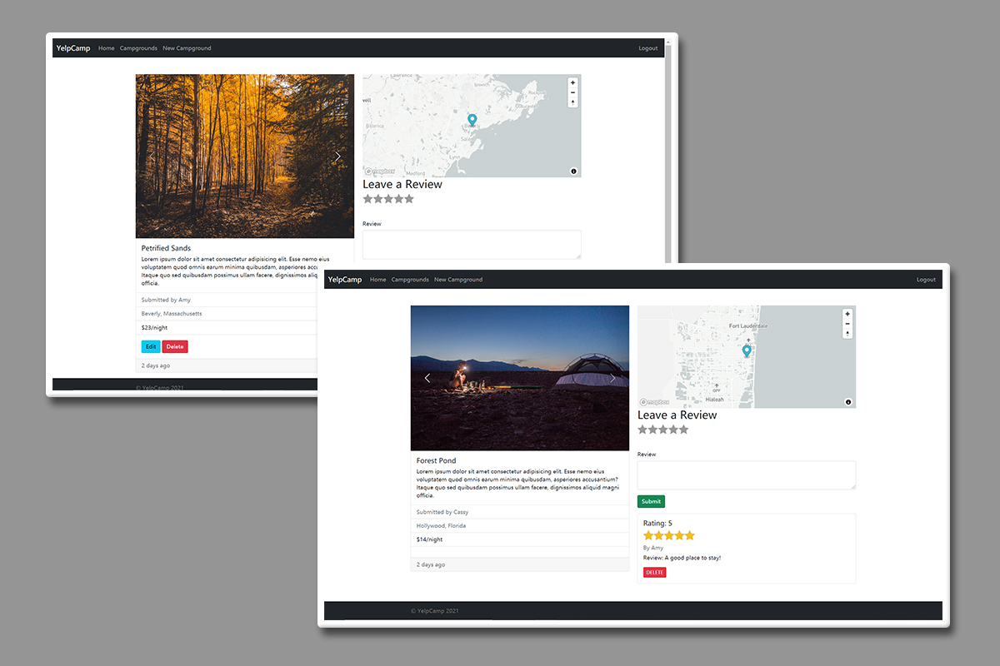

# YelpCamp 2021

YelpCamp is a Yelp style website for campgrounds, where people can share campsites with photos and comment on others. This app supports user authentication, posts management (creating, editing, and deleting), image uploading, and responsive design, etc. 

Try it: https://stark-stream-80494.herokuapp.com

## Features

### Responsive design


### Index page of campgrounds with a ClusterMap


### Campground details and its reviews



### Making new campground and editing previous posts (authentication required)


## Implementation

### Languages

- JavaScript
- EJS
- CSS

### Tools

- Node.js
- Express
- Bootstrap v5.0
- MongoDB
- NPM tools:
  - Mongoose
  - Passport.js: handle authentication
  - Joi: schema description & data validation
  - helmet: helps secure the app by setting various HTTP headers
  - express-mongo-sanitize: prevent MongoDB Operator Injection

### Services

- [Cloudinary](https://cloudinary.com/): store the images that users upload
- [MongoDB Atlas](https://www.mongodb.com/cloud/atlas): store the data of campground, reviews and users
- [Mapbox](https://www.mapbox.com/): provide interactive maps to mark the locations of campgrounds

## Run it locally

1. Clone this repository to the local computer

   ```
   git clone https://github.com/Sonia-96/YelpCamp
   cd YelpCamp
   npm install 
   ```

2. Install [MongoDB](https://www.mongodb.com/)

3. Create a Cloudinary account to get your **cloud name**, **API Key** and **API Secret**

4. Create a Mapbox account to get an **API access token**

5. Create an `.env` file in the root of this project and add following information:

   ```
   CLOUDINARY_CLOUD_NAME=<cloud name>
   CLOUDINARY_KEY=<API Key>
   CLOUDINARY_SECRET=<API Secret>
   MAPBOX_TOKEN=<API access token>
   ```

6. Run `mongod`, then run  `node app.js` in the terminal
7. Go to locohost:8080

## Credits

This app is the capstone project of Colt Steele's course: [The Web Developer Bootcamp 2021](https://www.udemy.com/course/the-web-developer-bootcamp/). Thanks for his creation of such a great course with comprehensive knowledge and this wonderful project.
